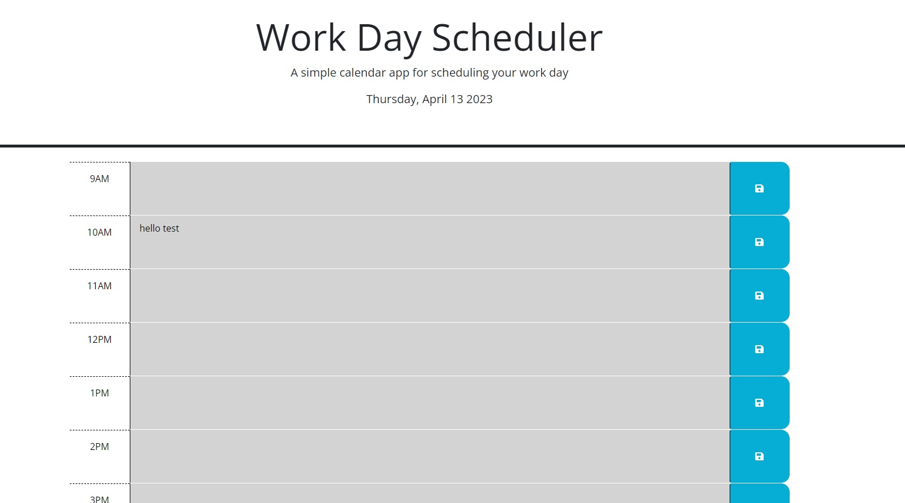

# Module 5 Calendar Project

In this Project I refactored some code for a simple Work Day Scheduler to utilize JS, jQuery, and dayjs to create a functional, albeit simple, daily scheduler.

## Installation

N/A
    
## Usage/Examples

To use simply click on the hour block that you want to add an event to.  Type your event and click the blue save button.  Once you click the button the event is stored in local storage and populated on your screen.  When you refresh the page the event will appear in the correct time slot.

## Lessons Learned

This project was a lesson in DOM traversal.  It is sometimes hard to wrap my head around ways that I can get to the element that I need to as it relates to things such as dynamic user input.
## Acknowledgements

https://readme.so

Course Material

MDN docs

## License

[MIT](https://choosealicense.com/licenses/mit/)

## Screenshots

